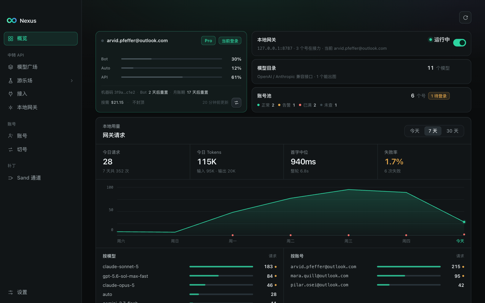
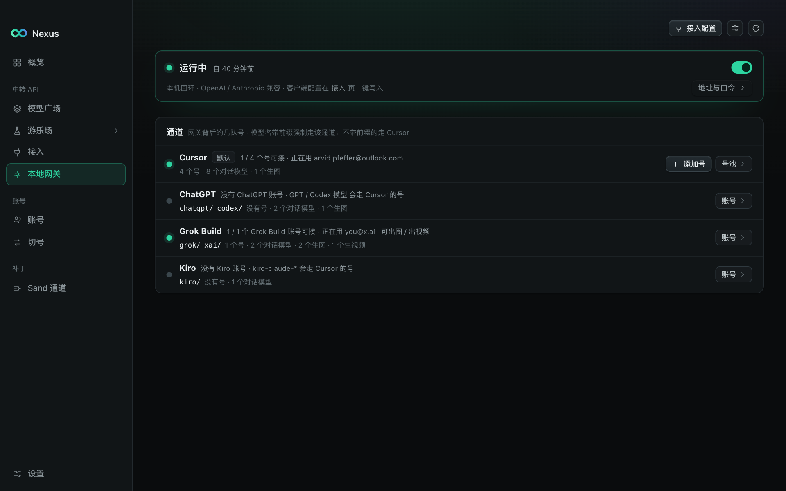
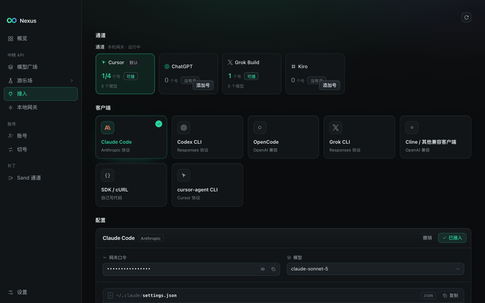
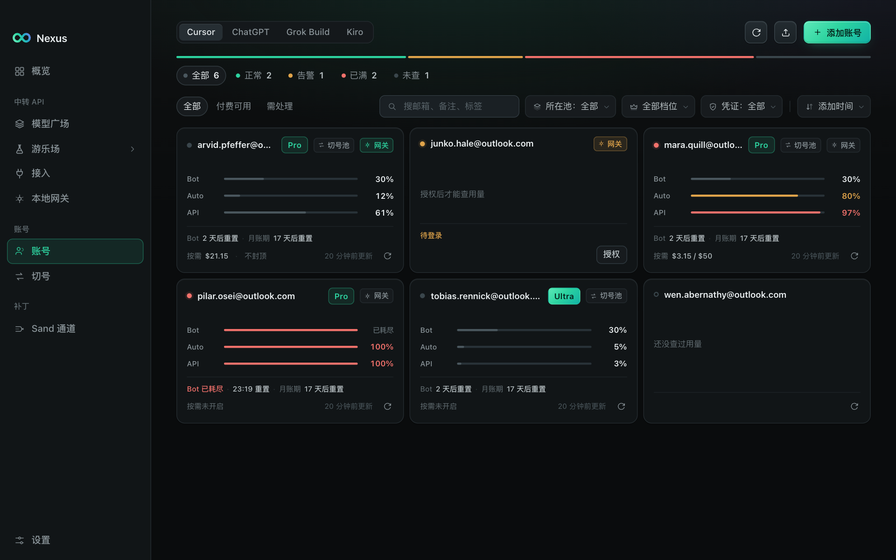
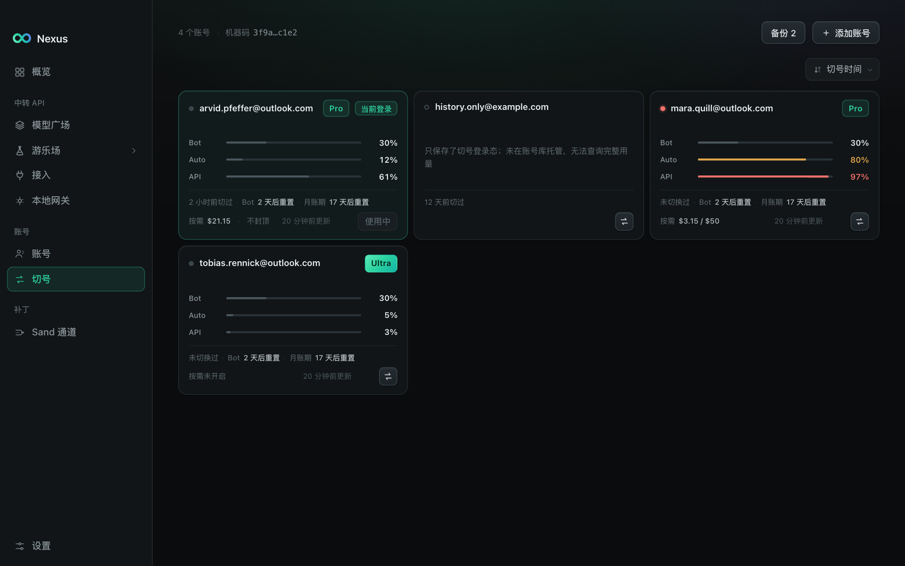
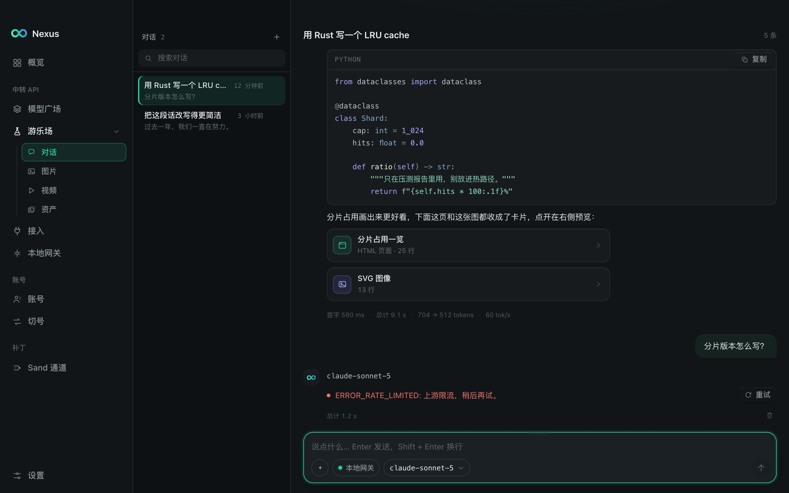

<div align="center">


# Nexus

**把你手里的 AI 订阅变成一个本机 OpenAI / Anthropic 兼容接口。**

[](https://github.com/roviix/nexus/actions/workflows/ci.yml)
[](https://github.com/roviix/nexus/releases)
[](./LICENSE)


中文 · [English](./README.en.md)

</div>

Nexus 是一个 Rust + Tauri v2 桌面应用（macOS / Windows）。它在 `127.0.0.1` 上起一个本地网关，
用你自己的 Cursor / ChatGPT / Grok / Kiro 账号做上游，对外暴露标准的
`/v1/chat/completions`、`/v1/messages`、`/v1/responses`、`/v1/models`、`/v1/images/generations`。
任何讲 OpenAI 或 Anthropic 方言的客户端——Claude Code、Codex CLI、OpenCode、官方 SDK、`curl`——
都可以直接指到它上面，不需要再申请一把 API key。

所有数据都在你自己的机器上：账号、token、请求账本、备份。没有云端，没有账户体系，没有遥测。



> 架构、关键机制与那些有意为之的取舍，见 [`docs/ARCHITECTURE.md`](./docs/ARCHITECTURE.md)；
> Sand 补丁与远程主机的决策记录见 [`docs/SAND.md`](./docs/SAND.md)。

## 能做什么

### 本地网关（主功能）

- **一个端口，四种方言。** OpenAI Chat Completions、Anthropic Messages（含 `count_tokens`）、
  OpenAI Responses、OpenAI Images。入站统一解析成一份中间表示再桥接到上游，流式 SSE 原样支持。
- **多平台上游。** Cursor（`aiserver.v1.InferenceService/Stream`）、ChatGPT 订阅号
  （`chatgpt.com/backend-api/codex`）、Grok、Kiro。模型目录（`/v1/models`）按上游能力自动汇总。
- **额度接力，不是负载均衡。** 一直用当前号，额度到线自动切到下一个；会话粘性天然成立，
  换号频率极低。
- **模型名映射。** Claude Code 发 `claude-sonnet-4-5`、Codex 发 `gpt-5`，网关把它们对到上游认识的
  名字；也可以强制所有请求走某个模型。
- **透传口。** 另开一个 h2c 口把 `cursor-agent` 的原生 Connect 流量换身份头后原样转发。
- **请求账本。** 每次请求记账号 / 模型 / token / 耗时，概览页看本地用量。



默认端口 `8787`，默认关闭；开启后：

```bash
curl http://127.0.0.1:8787/v1/chat/completions \
  -H "Authorization: Bearer $NEXUS_GATEWAY_TOKEN" \
  -H "Content-Type: application/json" \
  -d '{"model":"claude-sonnet-4-5","messages":[{"role":"user","content":"hi"}]}'
```

### 一键接入

「接入」页直接改客户端的配置文件，把 Claude Code（`~/.claude/settings.json`）、
Codex CLI（`~/.codex/config.toml`）、OpenCode 指到本地网关上；改之前先备份，一键可还原。



### 账号池

- 添加 Cursor / ChatGPT / Grok / Kiro 账号：OAuth 走系统浏览器登录，应用后台收 token；也可以粘
  refresh token 批量导入。
- 查看订阅、额度、重置时间；到期 / 封禁 / 额度耗尽自动标记。
- 凭证存在权限收紧（`0700` / `0600`）的本地 SQLite 里，不进系统钥匙串，也不上传任何地方。



### Cursor 切号

不逆向、不 patch、Cursor 升级不失效：直接写 Cursor 自己的登录态库（`state.vscdb`），一号一套
专属机器码，切之前自动备份、可还原。



### 游乐场

应用内的多轮对话工作台，直接打到本地网关；用来验证账号可用、对比模型输出。



### Sand 补丁（可选，进阶）

把 Cursor IDE 内置的 Agent 面板也改道到本地网关，让 IDE 里的推理也走你的账号池；支持通过 SSH
在远程开发机上安装。这一步会修改 Cursor 的应用文件，请先读
[`docs/SAND.md`](./docs/SAND.md) 与下方的「风险与免责」。

## 安装

到 [Releases](https://github.com/roviix/nexus/releases) 下载对应平台的安装包
（macOS `.dmg`、Windows `.exe`）。已签名的正式版支持应用内自动更新；未签名的 Preview 只能
手工下载，macOS 上首次打开需要在「系统设置 → 隐私与安全性」里放行。

## 从源码构建

依赖：Rust stable、Node.js 20+、Tauri v2 的
[平台前置条件](https://v2.tauri.app/start/prerequisites/)。

```bash
git clone git@github.com:roviix/nexus.git
cd nexus/apps/desktop
npm ci
npm run dev            # Vite + Tauri，热重载
npm run tauri build    # 出当前平台的安装包（未签名）
```

只想看界面、不想装 Rust 工具链的话，`ui-preview` 把 Tauri 那层换成假实现，纯浏览器就能跑：

```bash
cd apps/desktop && npm run preview:ui   # http://127.0.0.1:1500/?route=overview
```

也可以用脚本，只打当前平台该打的那种：

```bash
scripts/build-dmg.sh                                              # macOS，出 dmg（本机证书签名）
scripts/build-dmg.sh --install                                    # macOS，打完直接装进 /Applications
powershell -ExecutionPolicy Bypass -File scripts\build-windows.ps1 # Windows，出 nsis
```

macOS 这条**会签名**（`scripts/macos-signing-identity.sh` 挑本机钥匙串里的证书，没有就造一张
自签的）：不签的包拿不到系统「App 管理」权限，Sand 补丁装不上；签名不等于公证，包只在本机可用。

工程检查（CI 跑的就是这几条，macOS/Linux 与 Windows 都要过）：

```bash
cargo fmt --all -- --check
cargo clippy --workspace --all-targets -- -D warnings
cargo test --workspace
cd apps/desktop && npm run typecheck && npm test
node scripts/test-package-release.mjs
```

平台分支（`tasklist` / `taskkill`、`%APPDATA%` 路径、只读属性）在 Linux 上一行都编不到，
所以 CI 有一个单独的 `check-windows` job 跑同样的 clippy 与测试。

### 排障用的环境变量

| 变量 | 作用 |
|---|---|
| `CURSOR_USER_DIR` | 覆盖 Cursor 数据目录（也可在应用「设置」里改） |
| `CURSOR_STATE_DB` | 直接指定 `state.vscdb`，指到副本上可以安全地试切号 |
| `CURSOR_APP_PATH` | 覆盖 Cursor 应用本体位置（也可在应用「设置」里改） |
| `SAND_INFERENCE_ENDPOINT` | 装 Sand 补丁时把 Cursor 的推理改道到这个端点 |
| `NEXUS_PASSTHROUGH_DUMP_DIR` | 透传把入站推理请求体原样落盘到这个目录（会关掉流式转发；落盘的是业务明文，取证完就删） |

### 数据在哪

| | 数据与日志 | Cursor 数据目录 |
|---|---|---|
| macOS | `~/Library/Application Support/com.roviix.nexus/`、`~/Library/Logs/com.roviix.nexus/` | `~/Library/Application Support/Cursor` |
| Windows | `%APPDATA%\com.roviix.nexus\`、同目录 `logs\` | `%APPDATA%\Cursor` |

全部凭证都在应用数据目录下的 `nexus.db` 里，明文，不进系统钥匙串；目录收为 `0700`、文件收为
`0600`（取舍与理由见 [`docs/ARCHITECTURE.md`](./docs/ARCHITECTURE.md) §9.1）。整库搬家走
`~/.roviix/backups`；只搬账号可在账号页导出到 `~/.roviix/exports`，再在另一台机器「批量添加」
中导入。导出文件含明文凭证，用完就删。

## 仓库结构

```
.
├── Cargo.toml                      # workspace
├── crates/
│   ├── nexus-core/                 # 领域类型 / 错误 / id / 时间（无 IO）
│   ├── nexus-store/                # SQLite（数据 + 秘密）+ 迁移 + 活动日志 + 设置
│   ├── nexus-cursor/               # 定位、读写 state.vscdb 与机器码、进程控制
│   ├── nexus-switcher/             # 切号本、备份、切号编排
│   ├── nexus-accounts/             # 账号池、OAuth、刷 token、用量
│   ├── nexus-chatgpt/              # ChatGPT 订阅号：登录、刷 token、Codex 后端
│   ├── nexus-grok/ nexus-grokbot/  # Grok 账号与 Grok Bot 额度
│   ├── nexus-kiro/                 # Kiro 账号
│   ├── nexus-gateway/              # 本地网关：方言口 + 透传口 + 额度接力 + 账本
│   ├── nexus-connect/              # 一键接入：改 Claude Code / Codex / OpenCode 配置
│   ├── nexus-playground/           # 游乐场的线程 / 消息存储
│   └── nexus-sand/                 # Sand 补丁引擎（本机 + 远程 SSH）
├── apps/desktop/
│   ├── src-tauri/                  # Tauri 命令、事件、capabilities
│   ├── src/                        # React 前端
│   └── ui-preview/                 # 不起 Rust 也能跑的 UI 预览（mock core）
├── packages/design-tokens/         # CSS 变量
├── scripts/                        # 打包、签名、发布清单
└── docs/                           # ARCHITECTURE.md / SAND.md
```

**依赖只能向下**，且 `nexus-switcher` 与 `nexus-accounts` **互不依赖**——切号本与账号池是两个
独立模块，这条约束由 Cargo 依赖图强制执行。两者之间唯一的数据通路是
`accounts_add_to_switch_book` 命令里那一次显式拷贝。

## 发布

推一个 `v*` 标签（如 `v0.4.0`，须与 `Cargo.toml` / `package.json` / `tauri.conf.json` 里的版本一致），
[`release.yml`](./.github/workflows/release.yml) 会在 macOS 与 Windows 上打包、生成 SHA-256 / MD5 与
updater 用的 `latest.json`，并发到 GitHub Releases。自动更新端点固定为
`https://github.com/roviix/nexus/releases/latest/download/latest.json`。

需要的 GitHub 配置：

| 名称 | 类型 | 说明 |
|---|---|---|
| `TAURI_UPDATER_PUBLIC_KEY` | Variable | updater 公钥（写进 `tauri.conf.json`） |
| `TAURI_SIGNING_PRIVATE_KEY` / `TAURI_SIGNING_PRIVATE_KEY_PASSWORD` | Secret | updater 私钥，**必需** |
| `APPLE_CERTIFICATE` / `APPLE_CERTIFICATE_PASSWORD` / `APPLE_SIGNING_IDENTITY` / `APPLE_ID` / `APPLE_PASSWORD` / `APPLE_TEAM_ID` | Secret | 可选；缺则 macOS 出未签名 Preview |
| `WINDOWS_CERTIFICATE_BASE64` / `WINDOWS_CERTIFICATE_PASSWORD` | Secret | 可选；缺则 Windows 出未签名 Preview |
| `TAURI_UPDATER_ENDPOINT` | Variable | 可选；不填就用本仓库的 GitHub Releases |

两平台证书齐全时发**签名正式版**（进入自动更新）；否则发 **Preview**（只能手工下载）。

版本间的变化见 [CHANGELOG.md](./CHANGELOG.md)。

## 风险与免责

- Nexus 用你自己的订阅账号调用各平台的**非公开客户端接口**。这可能违反相关平台的服务条款，
  账号有被限流、警告或封禁的风险。请自行评估，**不要**用在你不能承受损失的账号上。
- Sand 补丁会修改 Cursor 的应用文件。它是幂等、可逆、带版本护栏的，但仍属于对第三方软件的
  改动；Cursor 升级后需要重新安装补丁。
- 本项目与 Cursor、OpenAI、xAI、Amazon 无任何关联，不受其背书。
- 软件按「原样」提供，不附带任何担保，详见 [LICENSE](./LICENSE)。

其余**有意为之**的取舍（凭证明文、网关对同机进程开放等）列在
[`docs/ARCHITECTURE.md`](./docs/ARCHITECTURE.md) §11，报 issue 前请先读一遍。

## 参与

见 [CONTRIBUTING.md](./CONTRIBUTING.md) 与 [行为准则](./CODE_OF_CONDUCT.md)。
安全问题请按 [SECURITY.md](./SECURITY.md) 私下报告。

## 许可

[MIT](./LICENSE) © 2026 Roviix
